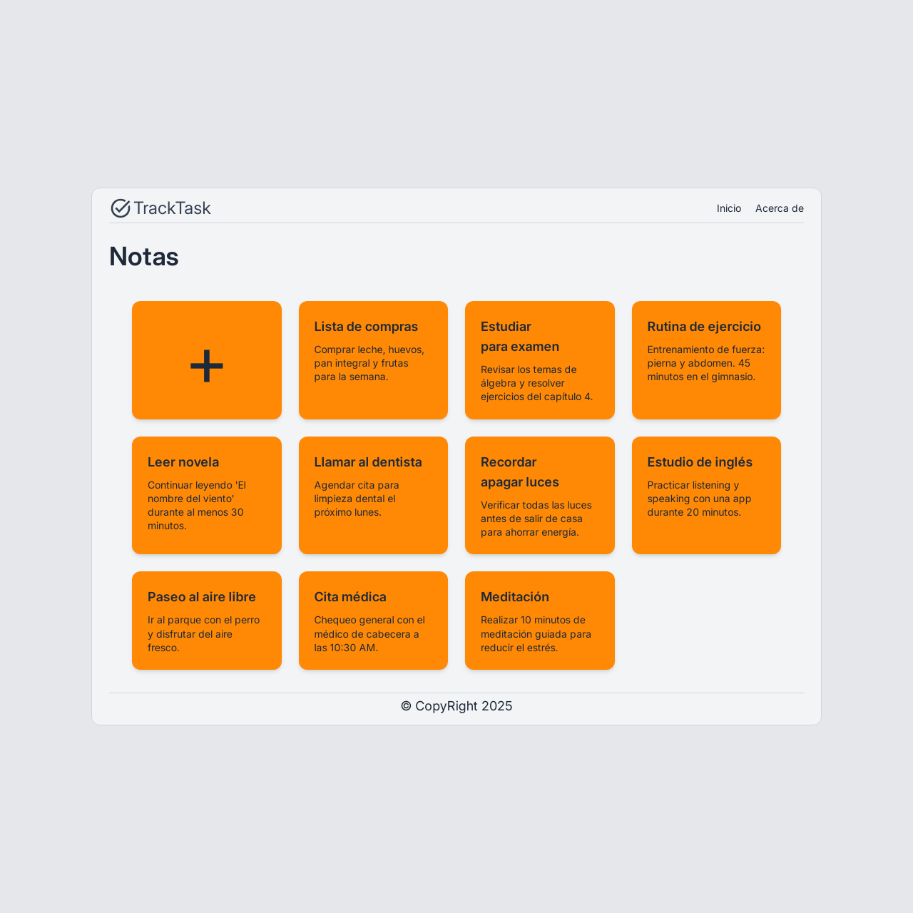

# 📌 TrackTask

<div align="center">




</div>

---

**Una aplicación simple y rápida para crear, ver, editar y eliminar tareas personales, construida con el stack MERN (MongoDB, Express, React, Node) y optimizada con Tailwind CSS para una interfaz moderna.**

## 🚀 Instrucciones para ejecutar localmente

1. Clona el repositorio

```
git clone https://github.com/mariadev22/TrackTask.git
cd TrackTask
```

2. Configura el backend

```
cd server
pnpm install
```

Crea un archivo .env con tu cadena de conexión de MongoDB:

```
MONGODB_URI=mongodb+srv://<usuario>:<contraseña>@cluster.mongodb.net/Note
```

Inicia el servidor:

```
pnpm run dev
```

3. Configura el frontend

```
cd client
pnpm install
```

Crea un archivo .env.local con tu cadena de conexión de servidor:

```
VITE_SERVER_URL=http://localhost:3000
```

Inicia el cliente:

```
pnpm run dev
```

## 🧪 Funcionalidades principales (MVP)

- Crear nota (POST)
- Leer notas (GET)
- Actualizar nota (PUT)
- Eliminar nota (DELETE)
- Detección automática del tema del navegador (oscuro/claro)
- Interfaz 100% responsive (adaptable a móviles, tabletas y escritorio)

### 🔒 Limitaciones actuales:

- No hay autenticación: cualquier persona con el enlace puede acceder y usar la aplicación.
- No hay sistema de prioridades ni organización por fechas.
